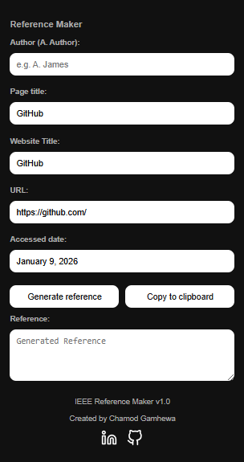

# IEEE Reference Maker

**IEEE Reference Maker** is a Chrome extension that helps you instantly generate IEEE-style citations for the current webpage or YouTube video you are watching. It automatically extracts available metadata (like author, title, and date).

## Inspiration
This extension was developed during my university studies to streamline the referencing process. From the begining goal was to simplify citation management and save valuable time for myself and I am happy to share this extension with you to make life easier.

## Features

- **Automatic Metadata Extraction**: Automatically fetches title, author, and date from the page.
- **YouTube Support**: specialized parsing for YouTube video titles, channels, and publish dates.
- **Instant Generation**: Creates a formatted IEEE reference with one click.
- **Clipboard Integration**: Copy the generated reference to your clipboard instantly.

## Installation

Since this extension is in development/local mode, you can install it via Chrome's Developer Mode:

1. Clone or download this repository to your local machine.
2. Open Google Chrome and navigate to `chrome://extensions/`.
3. Enable **Developer mode** by toggling the switch in the top-right corner.
4. Click the **Load unpacked** button.
5. Select the `chrome-reference-maker` folder from your file explorer.
6. The extension should now appear in your browser toolbar!

## Usage

1. Navigate to any webpage or YouTube video you want to cite.
2. Click the **IEEE Reference Maker** icon in your Chrome toolbar.
3. The popup will open with pre-filled fields (Author, Title, URL, Accessed Date, etc.).
4. Edit any details if necessary.
5. Click **Generate reference** to see the IEEE citation.
6. Click **Copy to clipboard** to copy the text to your clipboard.  

    
     
    <b>GUI interface for IEEE Reference Maker</b>

## Author

Created by **Chamod Gamhewa**.  
Linkedin: https://www.linkedin.com/in/chamod-gamhewa/  
Github: https://github.com/chamodxgamhewa

`Released version v1.0`